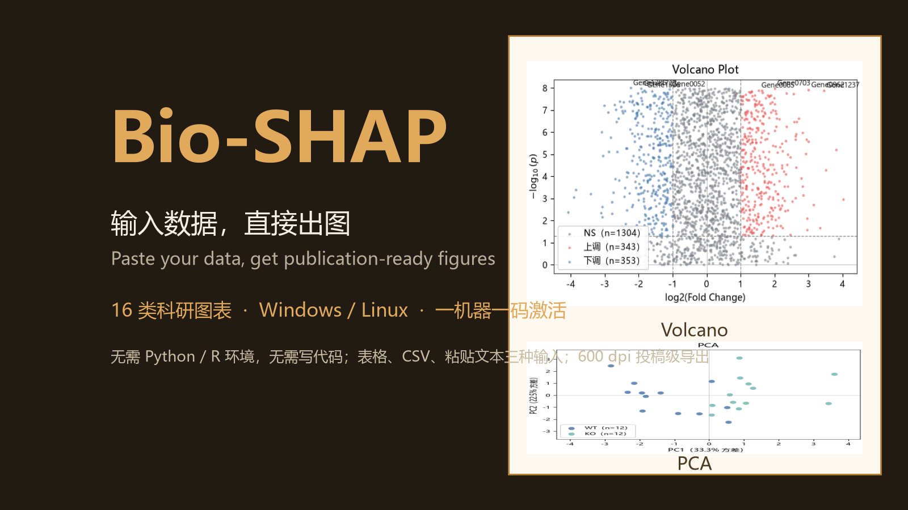
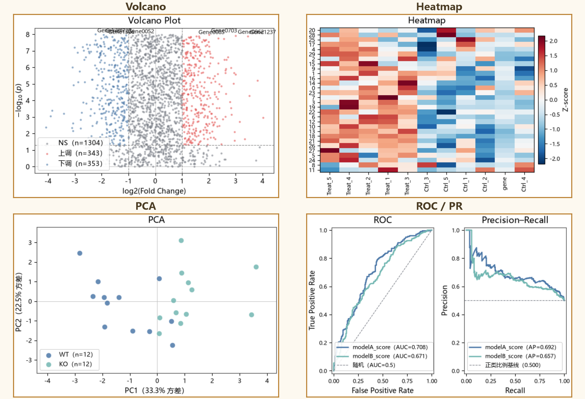
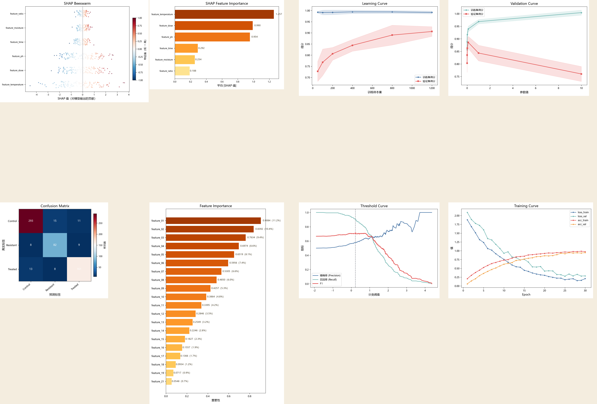

<p align="center">
  
</p>

<h1 align="center">Bio-SHAP</h1>

<p align="center">
  <b>输入数据，直接出图 · Paste your data, get publication-ready figures</b><br>
  面向科研人员的本地桌面制图软件：无需 Python/R 环境，无需写代码，一键生成投稿级 SCI 图表。<br>
  A local desktop plotting app for researchers — no coding, no Python/R setup, publication-ready figures in one click.<br>
  <b>Windows · Linux 双平台 | 16 类科研图表 | 一机器一码激活</b>
</p>

---

## 这是什么 / What is Bio-SHAP

**Bio-SHAP 是一款科研绘图桌面软件**：把表格数据丢进去，直接生成可发表的科研图表。它内置 16 类常用图表，覆盖**生信基础分析、分类模型诊断、机器学习可解释性（SHAP）、深度学习训练监控**四大场景；支持表格 / CSV / 粘贴文本三种输入方式，每类图都带示例数据——照着替换成自己的数据，即可出图。

**Bio-SHAP is a desktop plotting app for scientists.** Drop in your data and get publication-ready figures directly. With 16 built-in chart types across bioinformatics, classification diagnostics, ML explainability (SHAP) and deep-learning training, it accepts table / CSV / pasted-text input — every chart ships with example data, so you just swap in your own values and plot.

**它解决什么问题 / What problem it solves**

- 科研人不必再为"调 matplotlib / R ggplot 代码"花时间：填好列名、点一下，图就出来；
- 不用在服务器上折腾 Python 环境，本机绿色运行；
- 火山图、热图、ROC、SHAP 这类"高频投稿图"全部内置，参数可调、输出 600 dpi 投稿级文件。

---

## 功能特性 / Key Features

| 中文 | English |
|---|---|
| 三种数据输入：表格 / CSV / 粘贴文本 | Table, CSV or paste-text input |
| 内置 16 类图表，均带示例数据一键加载 | 16 chart types, each with one-click example data |
| 每类图独立参数面板，选列名即绘图 | Per-chart parameter panel; pick columns and plot |
| 导出 PNG / SVG / PDF，600 dpi 投稿级 | Export PNG / SVG / PDF at 600 dpi |
| 默认中文字体渲染，无乱码 | CJK font support, no tofu characters |
| matplotlib 缩放工具栏，细节检视 | Built-in zoom toolbar for inspection |
| 5 套界面主题（生物绿 / 深空蓝 / 基因霓虹 / 论文极简 / 土黄大地） | 5 UI themes (Bio Green / Deep Space Blue / Gene Neon / Paper Minimal / Earth Ochre) |
| 专业模式 + 向导模式，随时切换、自动保存进度 | Professional & wizard modes, freely switchable, auto-save |
| 一机器一码激活，默认 1 年有效期，离线证书兜底 | One machine, one code; 1-year default validity; offline cert fallback |
| Windows 免安装绿色版 + Linux 脚本安装 | Green Windows build + Linux script install |

---

## 16 类图表 / 16 Chart Types

**生信基础 / Bioinformatics**
火山图（差异表达）· 热图（Z-score、聚类）· PCA（95% 置信椭圆）· 箱线图/小提琴图 · 相关性热图

**分类诊断 / Classification Diagnostics**
ROC/PR 曲线（多模型对比）· 校准曲线 · 回归诊断（观测 vs 预测）· 混淆矩阵（三分类）· 指标-阈值曲线

**机器学习解释 / ML Explainability**
SHAP 蜂群图 · SHAP 特征重要性条形图 · 学习曲线 · 验证曲线 · 特征重要性条形图

**深度学习 / Deep Learning**
训练曲线（loss / acc 多序列）

**图例示例 / Gallery**

<p align="center">
  <br>
  <sub>火山图 · 热图 · PCA · ROC/PR（生信基础与模型评估）</sub>
</p>

<p align="center">
  <br>
  <sub>SHAP 蜂群 · SHAP 重要性 · 学习曲线 · 验证曲线 · 混淆矩阵 · 特征重要性 · 阈值曲线 · 训练曲线</sub>
</p>

---

## 下载与安装 / Download & Install

### 两个 Windows 安装包怎么选

| 文件 | 说明 | 适合谁 |
|---|---|---|
| `Bio-SHAP-win64-1.0.0.zip` | 解压后双击 `Bio-SHAP.exe` 即用，无需安装 | 快速试用、U 盘便携 |
| `Setup-Bio-SHAP-1.0.0.exe` | 安装向导，可选安装盘/目录，生成开始菜单与桌面快捷方式 | 正式安装 |

两个包功能完全一致，仅分发形态不同。**用户电脑无需预装 Python 或任何依赖。**

### 系统要求 / System Requirements

- Windows 10 / 11（64 位）· Windows 10/11 (64-bit)
- Linux（构建脚本见 `Linux/` 目录，支持 Debian/Ubuntu 系）· Linux (see `Linux/` for build scripts, Debian/Ubuntu-based)
- 内存 ≥ 4 GB 建议 · RAM ≥ 4 GB recommended

### 安装包内部结构 / What's Inside

```
Bio-SHAP/
├── Bio-SHAP.exe              ← 程序入口（双击运行）
└── _internal/
    ├── app/                  ← 软件代码（16 类绘图模块）
    ├── desktop/              ← 界面程序（5 套主题）
    ├── data/example/         ← 每类图内置示例数据（CSV）
    ├── desktop/assets/       ← 图标、主题、验签公钥 public.pem
    ├── PySide6/ matplotlib/ pandas/ numpy/ scipy/ sklearn/ ...  ← 运行库
    └── python312.dll         ← 内置 Python 运行时
```

---

## 快速开始 / Quick Start

1. 启动软件，首次打开弹出**激活窗口**，显示本机**设备码**（每台机器唯一）;
2. 将设备码发送给作者 → 收到**激活码**;
3. 粘贴激活码，点击"立即激活"（在线优先）→ 进入主界面;
4. 选择图表类型 → 加载示例数据或导入自己的数据 → 设置列名 → 点击绘制 → 导出。

Activation: one machine, one code; default 1-year validity; offline certificate (`.bio`) import supported when offline.

> 完整的使用与故障排查见 [`安装包内容说明.md`](安装包内容说明.md)。

---

## 常见问题 / FAQ

**Q：杀毒软件报毒 / Antivirus warning?**
A：程序为打包软件、无数字签名，个别杀软可能误报，添加信任即可。The binaries are unsigned; add an exception if flagged.

**Q：激活失败 / Activation failed?**
A：确认激活码与设备码匹配；局域网激活需把服务器地址改成作者电脑的局域网 IP；仍失败请把报错文字发给作者。

**Q：换电脑 / 重装系统?**
A：每台机器设备码不同，新机器需重新获取激活码；重装系统后原设备码不变，原激活码可再次使用（过期需续期）。

---

## 安全声明 / Security Note

- 安装包**仅包含验签公钥**，不含主密钥、签名私钥、发码工具与激活台账；
- 绘图全程在本机完成，程序不采集、不上传用户数据；
- 仅在激活/续期时连接作者指定的许可证服务器（默认本机 `127.0.0.1:8765`）。

---

<p align="center"><sub>Bio-SHAP v1.0.0 · 联系作者获取激活码 · Copyright © 2026</sub></p>
